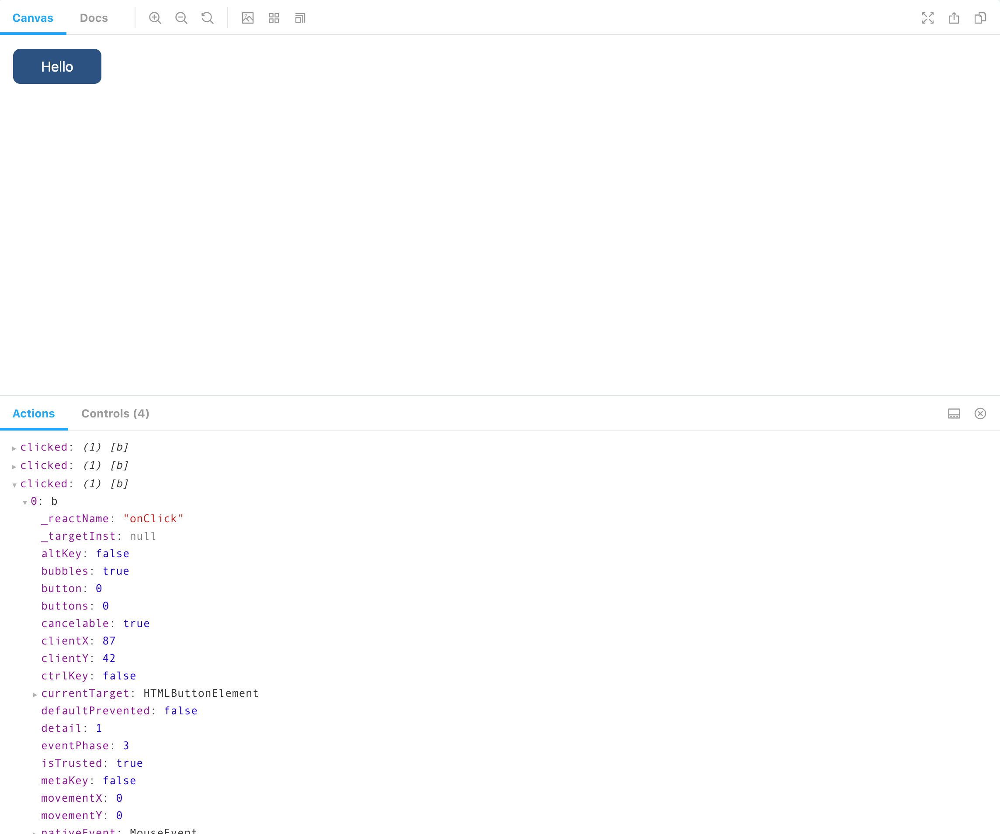

The new web development paradigm is to develop components that are small,
descriptive, and easily portable. Check out any front-end framework you like:
React, Vue, Angular, etc. You'll see that they are all geared towards
creating UI components.

UI Components are excellent because they allow a project to build up a library of
(ideally) accessible UI elements that can be implemented throughout the
project. This keeps things DRY and helps maintain order within a project.

If you're like me, though, managing, maintaining, documenting, distributing,
and testing that component library can become cumbersome. It's all well and
good that you have a fancy "Button" component, but there's no good way to see
that component in action other than importing it into a project and starting
to tinker. Likewise, for development: it's difficult to isolate your
component and test it live without implementing it directly in the project
somewhere.

At _MachineServant_, we use [Storybook](https://storybook.js.org) to organize,
test, and maintain our component library. You can check out the _Storybook_
site for our component library [here](https://storybook.machineservant.com).

# What is Storybook?

_Storybook_ is a tool for developing components in isolation. It provides a
navigable UI where all your components live and can be organized, viewed, and
altered to some degree.

Think about it as a combination of a development workspace and a
self-documenting component library playground.

# How does Storybook work?

At its core, the main building block of _Storybook_ is something called a
"Story." Stories describe a specific use case for a component. Generally, all
stories belonging to a component live with that component in a `.stories.js`
file (or `.stories.tsx` file if you're using typescript/React).

## Getting started with a basic component

For example, if you start with a fairly basic `jsx+><Button>` component like
this:

```typescript
// components/Button.tsx
import React from 'react';

export type ButtonProps = {
  backgroundClassName?: string;
  textClassName?: string;
  className?: string;
} & React.ComponentPropsWithoutRef<'button'>;

export const Button: React.FC<ButtonProps> = ({
  className = '',
  backgroundClassName = 'bg-blue-800',
  textClassName = 'text-white',
  children,
  ...props
}) => (
  <button
    className={`rounded-lg py-2 px-8 ${backgroundClassName} ${textClassName} ${className}`}
    {...props}
  >
    {children}
  </button>
);
```

Next, you would create a `Button.stories.tsx` file and place it next to the
component file:

```typescript
// components/Button.stories.tsx
import { Story } from '@storybook/react/types-6-0';
import React from 'react';

import { Button } from './Button';

const config = {
  component: Button,
  title: 'Button',
};

export default config;

const Template: Story = (args) => <Button {...args} />;

export const Default = Template.bind({});
Default.args = {
  children: 'Hello',
};
```

This is a standard starting point for most stories, and it is outlined in much
greater detail in the [official
tutorials](https://www.learnstorybook.com/intro-to-storybook/react/en/simple-component/)
pages on the _Storybook_ website.

If you run the storybook application, you'll see that you have a nice little
user interface for your component to play with.


## Adding "Actions"

That's pretty basic, though. Let's add an `onClick` handler and track those
clicks to make sure they work.

First we alter the Button component by passing an expected `onClick`
parameter through to the `jsx+><Button>` component:

```typescript
// components/Button.tsx

import React from 'react';

export type ButtonProps = {
  backgroundClassName?: string;
  textClassName?: string;
  className?: string;
  onClick?: (event: React.MouseEvent<HTMLButtonElement>) => void; // highlight-line
};

export const Button: React.FC<
  ButtonProps & React.ComponentPropsWithoutRef<'button'>
> = ({
  className = '',
  backgroundClassName = 'bg-blue-800',
  textClassName = 'text-white',
  children,
  onClick, // highlight-line
  ...props
}) => (
  <button
    className={`rounded-lg py-2 px-8 ${backgroundClassName} ${textClassName} ${className}`}
    onClick={onClick} // highlight-line
    {...props}
  >
    {children}
  </button>
);
```

Then we modify the `Button.stories.tsx` file to account for the new `onClick`
handler:

```typescript
// components/Button.stories.tsx

import { Story } from '@storybook/react/types-6-0';
import React from 'react';

import { Button } from './Button';

const config = {
  component: Button,
  title: 'Button',
  argTypes: { onClick: { action: 'clicked' } }, // highlight-line
};

export default config;

const Template: Story = (args) => <Button {...args} />;

export const Default = Template.bind({});
Default.args = {
  children: 'Hello',
};
```

This leverages _Storybook_'s "Actions" plugin. As before, you can find much
more information about how "_Storybook_ Actions" work by visiting their
[documentation page](https://storybook.js.org/docs/react/essentials/actions).

After that code is in place, reloading the storybook UI and clicking the
button will output some informative text in the "Actions" tab, letting you
know that it was clicked. This is a great way to visually verify that
your click handler is functioning as expected.



## Playing with the "Controls" tab

You may have noticed the "Controls" tab next to the "Actions" tab. _Storybook_
controls are usually auto-detected by inspection of the component being
worked upon, if you're using typescript, then _Storybook_ will inspect your
`typescript+>type` definitions to extract useful controls that can be
modified at runtime. If you're using vanilla JavaScript, then _Storybook_ will
inspect any `typescript+>PropTypes` you provide.

If you click on the "Controls" tab, you should see that you can modify
various properties on the component. Let's make the background of the
component red.

Since this component uses _tailwindcss_ to style things, we can simply add
the `css+>.bg-red-700` class name as the `backgroundClassName` value. Once
that is done, the component updates live!


As you can see, the controls pre-populate with any default values from the
component, and any `typescript+>string` type fields will automatically be
rendered as text boxes for you to modify. This automatic detection will work
for almost all basic properties (booleans, numbers, arrays, objects,
enums, strings). It's also possible to create customized controls for more
advanced data types. Check out the
[documentation](https://storybook.js.org/docs/react/essentials/controls) for
a better writeup of how this works.

# Conclusion

If you have been looking for a way to isolate your components, manage
development of those components, and distribute documentation of those
components to your team, _Storybook_ seems like a perfect tool for the job.

At _MachineServant_, we have been using _Storybook_ to some success. Keeping all
our components housed in a components library with detailed stories for each
component means that we have a very easy to manage and maintain component
library that everyone has access to and can test with ease.

Combining this with _bit.dev_ ([https://bit.dev](https://bit.dev)) means that
we have a component library that can be worked upon in isolation while also
having the ability to version control, package, and import our components
into our projects.

I will be writing a follow-up blog post to this one that outlines how we use
_bit.dev_ at _MachineServant_. Combining _Storybook_ and _bit.dev_ has made
our component library extremely flexible.
