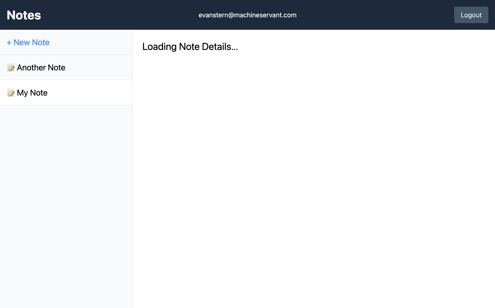

One of Remix's coolest features is the `useTransition` hook, which provides the basis for an "Optimistic UI" experience. You can read about this [in the official Optimistic UI guide](https://remix.run/docs/en/v1/guides/optimistic-ui).

In this post, I'm going to run through a specific use-case that isn't really touched upon in the official guide.

## The setup

Let's say you have an app that shows a list of notes.

Let's say it looks something like this:


> (Yes, I'm going to be using the starter app from `remix-run/indie-stack` stack).

If you click on a note, you see the note details:


If you click the Edit button you get to the edit note page:


All fairly simple.

The file structure of such an app's routes might be something like this:

```
/routes
  /notes
    $noteId/
      edit.tsx
      index.tsx
    index.tsx
  notes.tsx
```

The `notes.tsx` route would be something like this:

```tsx
export async function loader({ request }: LoaderArgs) {
  const userId = await requireUserId(request);
  const noteListItems = await getNoteListItems({ userId });
  return json({ noteListItems });
}

export default function NotesPage() {
  const data = useLoaderData<typeof loader>();

  return (
    <div className="flex h-full min-h-screen flex-col">
      <header className="flex items-center justify-between bg-slate-800 p-4 text-white">
        /* header stuff */
      </header>

      <main className="flex h-full bg-white">
        <div className="h-full w-80 border-r bg-gray-50">
          <Link to="new" className="block p-4 text-xl text-blue-500">
            + New Note
          </Link>

          <hr />

          {data.noteListItems.length === 0 ? (
            <p className="p-4">No notes yet</p>
          ) : (
            <ol>
              {data.noteListItems.map((note) => (
                <li key={note.id}>
                  <NavLink
                    className={({ isActive }) =>
                      `block border-b p-4 text-xl ${isActive ? 'bg-white' : ''}`
                    }
                    to={note.id}
                  >
                    📝 {note.title}
                  </NavLink>
                </li>
              ))}
            </ol>
          )}
        </div>

        <div className="flex-1 p-6">
          <Outlet />
        </div>
      </main>
    </div>
  );
}
```

So, the `index.tsx` and `edit.tsx` routes would become child routes that render inside the `<Outlet />`. The header and the sidebar would be static throughout the app and you'd either see a simple landing page (at the `/notes` endpoint), or you'd see the details (at the `/notes/:id` endpoint), or you'd see the edit dialog for a note (at the `/notes/:id/edit`) endpoint.

That's the basic setup. Next we're going to try to use some Optimistic UI to enhance this app.

```tsx
export default function NotesPage() {
  const data = useLoaderData<typeof loader>();
  // highlight-start
  const transition = useTransition();
  // highlight-end

  return (
    <div className="flex h-full min-h-screen flex-col">
      <header className="flex items-center justify-between bg-slate-800 p-4 text-white">
        /* header stuff */
      </header>

      <main className="flex h-full bg-white">
        <div className="h-full w-80 border-r bg-gray-50">
          <Link to="new" className="block p-4 text-xl text-blue-500">
            + New Note
          </Link>

          <hr />

          {data.noteListItems.length === 0 ? (
            <p className="p-4">No notes yet</p>
          ) : (
            <ol>
              {data.noteListItems.map((note) => (
                <li key={note.id}>
                  <NavLink
                    className={({ isActive }) =>
                      `block border-b p-4 text-xl ${isActive ? 'bg-white' : ''}`
                    }
                    to={note.id}
                  >
                    📝 {note.title}
                  </NavLink>
                </li>
              ))}
            </ol>
          )}
        </div>

        <div className="flex-1 p-6">
          // highlight-start
          {transition.state === 'loading' ? (
            <h1 className="mx-auto text-2xl">Loading Note Details...</h1>
          ) : (
            <Outlet />
          )}
          // highlight-end
        </div>
      </main>
    </div>
  );
}
```

Now, when we click on a note, we'll see this page while the data is being fetched:



## The problem

But what happens when we click the Edit button from the note details page?

Let's try it:


Uh oh. It's the same loading message. That's going to confuse people because we say we're loading the note details! This is even more of a problem if you've gone through the trouble of creating an actual component that scaffolds out the note details by displaying placeholder information or a skeleton UI. Clicking the edit button would show **that** component instead of the "edit" component.

So, what do we do?

## The solution

We use a little-exposed feature of the `Link` component: `state`.

As far as I can tell, the fact that `Link`s have a `state` attribute isn't documented anywhere. But they do, and you can shove information into it that will pass down through the `useTransition` hook and use it to dynamically render the correct UI depending on what that state is.

Here's some code.

First, some edits to the `notes.tsx` page.

```tsx
// highlight-start
type TransitionLocationState = {
  page: 'note' | 'edit-note';
};
// highlight-end

export default function NotesPage() {
  const data = useLoaderData<typeof loader>();
  const transition = useTransition();

  // highlight-start
  const OptimisticUI = useMemo(() => {
    if (transition.state === 'loading') {
      const { page } =
        (transition.location?.state as TransitionLocationState) || {};

      // we're assuming we've created some reusable Note and EditNote components
      switch (page) {
        case 'note': {
          return <Note />;
        }
        case 'edit-note': {
          return <EditNote />;
        }
      }
    }

    return null;
  }, [transition.state, transition.location?.state]);
  // highlight-end

  return (
    <div className="flex h-full min-h-screen flex-col">
      <header className="flex items-center justify-between bg-slate-800 p-4 text-white">
        /* header stuff */
      </header>

      <main className="flex h-full bg-white">
        <div className="h-full w-80 border-r bg-gray-50">
          <Link to="new" className="block p-4 text-xl text-blue-500">
            + New Note
          </Link>

          <hr />

          {data.noteListItems.length === 0 ? (
            <p className="p-4">No notes yet</p>
          ) : (
            <ol>
              {data.noteListItems.map((note) => (
                <li key={note.id}>
                  <NavLink
                    className={({ isActive }) =>
                      `block border-b p-4 text-xl ${isActive ? 'bg-white' : ''}`
                    }
                    to={note.id}
                  >
                    📝 {note.title}
                  </NavLink>
                </li>
              ))}
            </ol>
          )}
        </div>

        <div className="flex-1 p-6">
          // highlight-start
          {transition.state === 'loading' ? OptimisticUI : <Outlet />}
          // highlight-end
        </div>
      </main>
    </div>
  );
}
```

Then, we need to update the links that take us to the edit and details pages:

First, the edits to the `notes.tsx` page:

```tsx
// ...

<div className="h-full w-80 border-r bg-gray-50">
  <Link to="new" className="block p-4 text-xl text-blue-500">
    + New Note
  </Link>

  <hr />

  {data.noteListItems.length === 0 ? (
    <p className="p-4">No notes yet</p>
  ) : (
    <ol>
      {data.noteListItems.map((note) => (
        <li key={note.id}>
          <NavLink
            className={({ isActive }) =>
              `block border-b p-4 text-xl ${isActive ? 'bg-white' : ''}`
            }
            to={note.id}
            // highlight-start
            state={{ page: 'note' }}
            // highlight-end
          >
            📝 {note.title}
          </NavLink>
        </li>
      ))}
    </ol>
  )}
</div>

// ...
```

Now here's an example of what the `Note.tsx` component might look like along with the "Edit" link.

```tsx
import { Form, Link } from '@remix-run/react';

interface NoteProps {
  data?: {
    note: {
      id: string;
      title: string;
      body: string;
    };
  };
}

export const Note: React.FC<NoteProps> = ({ data }) => {
  return (
    <div>
      <h3 className="text-2xl font-bold">
        // highlight-start
        {data ? (
          <>{data?.note.title}</>
        ) : (
          <span className="text-gray-500">Note</span>
        )}
        // highlight-end
      </h3>
      <p className="py-6">
        // highlight-start
        {data ? (
          <>{data?.note.body}</>
        ) : (
          <span className="text-gray-500">Loading...</span>
        )}
        // highlight-end
      </p>
      <hr className="my-4" />
      <div className="flex items-center gap-4">
        <Link
          className="rounded bg-green-500 py-2 px-4 text-white hover:bg-green-600 focus:bg-green-400"
          to={`/notes/${data?.note.id}/edit`}
          // highlight-start
          state={{ page: 'edit-note' }}
          // highlight-end
        >
          Edit
        </Link>
        <Form method="post">
          <button
            type="submit"
            className="rounded bg-blue-500  py-2 px-4 text-white hover:bg-blue-600 focus:bg-blue-400"
            disabled={!data}
          >
            Delete
          </button>
        </Form>
      </div>
    </div>
  );
};
```

This pattern can be extended to cover lots of different use cases. You can slap any state you want in there. For example, if you want to display the note's id in the title, you can add an optional `meta` state attribute with that information and then pass it through to the `Note` component:

```tsx
type TransitionLocationState = {
  page: 'note' | 'edit-note';
  // highlight-start
  meta?: {
    [key: string]: string;
  }
  // highlight-end
};

// Inside the OptimisticUI memo
const { meta } = transition.location?.state as TransitionLocationState || {}
switch (page) {
  case 'note': {
    return <Note id={meta?.noteId} />;
  }
  case 'edit-note': {
    return <EditNote />;
  }
}

// On the link
<NavLink to={`/notes/${note.id}`} state={{ page: 'note', meta: { noteId: note.id }}}>
```

## Links to resources

You can find a repository that demos this [here](https://github.com/Machine-Servant/optimistic-ui-with-transition-state)
