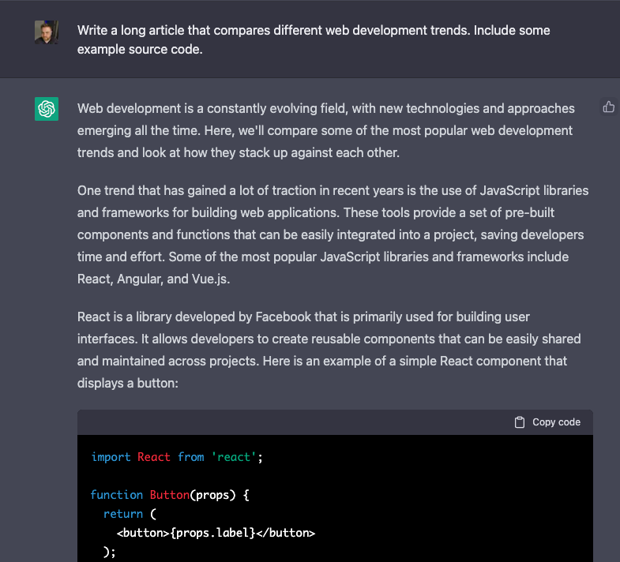
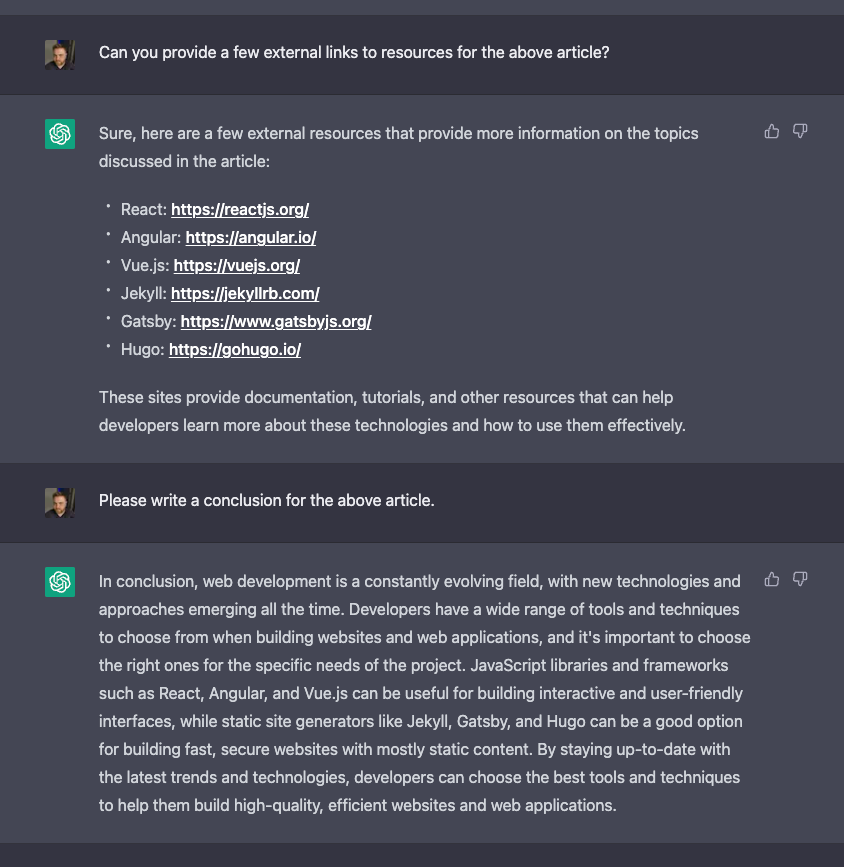

I can assure you I'm a real person, not an AI. I wrote this. Me, a human being sitting at my desk. Today I drove to the store and bought some diet soda and just finished drinking it. I'm totally a person.

But can you really believe me?

## Table of Contents

```toc
exclude: Table of Contents
toHeading: 5
```

For years, AI bots have been pumping out blog posts for people who need content and for whatever reason were not willing or able to make it themselves. And, almost without fail, it was easy to see through those blog posts for what they were.

But that seems to be changing.

AI and Machine Learning have advanced quite a lot. The tool that's getting a lot of buzz lately is [ChatGPT](https://openai.com/blog/chatgpt/).

I sat down with ChatGPT to do a little experiment earlier today. I asked ChatGPT to write me a blog post about web development.

In this post, I'm going to talk about what that experience was like. In a [follow-up post](/blog/2023-01-06-web-development-trends), I'll actually publish the article that ChatGPT created for me (I'll preface that article with a blurb explaining that it was written by a non-human, non-diet-soda-drinking, machine).

## The prompt

The first thing I did was ask a very simple, but very human readable, question to ChatGPT.



The prompt I used was "Write a long article that compares different web development trends. Include some example source code."

That's pretty simple, but it's not something I would expect your average AI bot to be able to really understand. It has several requests (write the article, make it about a specific topic, and add relevant source code examples). The real test is whether or not the results are good enough to fool me.

I also asked ChatGPT to give me some links to resources that would be helpful to someone reading the article, and to write a conclusion.



## The result

Yeah. It's pretty good. I actually got goosebumps.

In the [follow-up post](2023-01-06-web-development-trends) you can see the results.

It's not a work of art. But, you know, nothing I do myself is either. But, it was able to write a pretty good introduction to current web development trends. It kept on topic, added some relevant code examples, and didn't write anything that looked factually incorrect. That's a pretty cool result.

I'm fairly certain I could keep working with ChatGPT to get it to tweak the article even more to get more depth and ask it to write more about specific technologies. But this was just a quick test.

## What does this mean for us?

I think ChatGPT is probably a little ways away from completely replacing its human overlords. But it's going to get better. And it already does enough that I think we may see more AI written blogs that are going to be pretty hard to distinguish from the "genuine" article, so-to-speak.

One thing I'm curious about is whether or not Google or other search engines will be able to figure out if an article is AI written by ChatGPT and if they'll want to de-prioritize those articles from search results.

Frankly, if the AI gets to a point that it is indistinguishable from any dude behind a computer, does it really matter?
