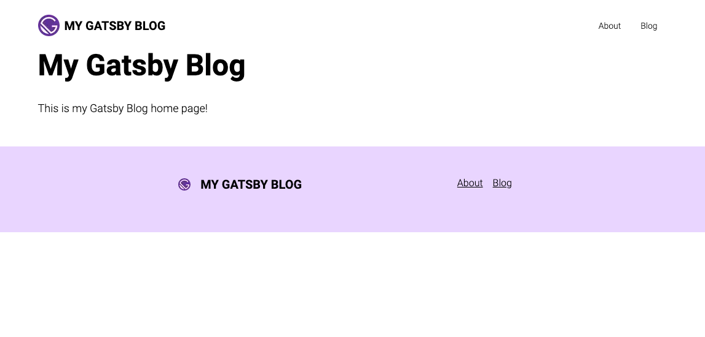

Welcome back to "Building a GatsbyJS Blog"! In this second part of the series, we'll focus on creating the Layout and pages for our blog. We'll start by creating a reusable component, the "Layout," which we'll use on all our pages to ensure a consistent design. Next, we'll make the pages for our blog and add some primary content. While we won't be adding the blog post pages just yet, we'll lay the groundwork for them in the next series post. So, let's get started with "Building a GatsbyJS Blog: Layout and Pages."

import { GatsbyBlogSeriesPage } from '../../components/mdx-components';

<GatsbyBlogSeriesNavigation
  currentPage={GatsbyBlogSeriesPage.P2_LAYOUT_AND_PAGES}
/>

## Navigation and Routing

To begin with, though. Let's do some preparation.

### Define the navigation routes

First, we will define our navigation routes in the `gatsby-config.ts` `siteMetadata` section. This will help us later when we want to ensure our navigation links are uniform and have a single source of truth.

> The `siteMetadata` section of your config is an excellent place to store any information about the site to which you will want easy access. Contact info, social media accounts, and navigation route definitions are perfect examples of things to store there.

Open up your `gatsby-config.ts` file and add the following code to the `siteMetadata` section:

```typescript
siteMetadata: {
  title: `My Gatsby Blog`,
  siteUrl: `https://www.yourdomain.tld`,
  // ↓ Add this section
  navigation: [
    {
      name: 'About',
      path: '/about',
    },
    {
      name: 'Blog',
      path: '/blog'
    }
  ]
},
```

### Create the `useMetadata` hook.

We will often refer to the site metadata, so it's a good idea to have a reusable utility to quickly gather the information. We are going to do that by making use of a custom React hook we'll call `useMetadata`.

Create a new folder and file called `src/hooks/use-site-metadata.ts`

```bash
mkdir src/hooks
touch src/hooks/use-site-metadata.ts
```

Then, add the following content to the file:

```typescript
// src/hooks/use-site-metadata.ts
import { graphql, useStaticQuery } from 'gatsby';

export const useSiteMetadata = () => {
  const data = useStaticQuery<{
    site: { siteMetadata: Queries.SiteSiteMetadata };
  }>(graphql`
    query SiteMetadataQuery {
      site {
        siteMetadata {
          title
          siteUrl
          navigation {
            name
            path
          }
        }
      }
    }
  `);

  return data.site.siteMetadata;
};
```

This custom hook can be added to any page or component in our codebase, making accessing the site's information easy. Of course, as we add more metadata, we'll need to update this query.

> You may prefer the file name `useSiteMetadata.ts`; I've settled into a specific naming convention and folder structure for all my TypeScript projects, and your mileage may vary. Feel free to modify this to whatever you prefer. No judgment! 😊

> **NOTE**: You'll need to restart the development server for the site metadata to be recognized and for the TypeScript types to be generated correctly.

### Create the Header component

The Layout component we will create will have a header with a navigation section. We should build that component now, so we have it ready when we want to use it in the Layout.

Create a new file for the page header:

```bash
mkdir ./src/components/
touch ./src/components/PageHeader.tsx
```

Add the following content to that file:

```typescript
// src/components/PageHeader.tsx
import { Link } from 'gatsby';
import { StaticImage } from 'gatsby-plugin-image';
import React from 'react';
import { useSiteMetadata } from '../../hooks/use-site-metadata';

export const PageHeader: React.FC = () => {
  const { title, navigation } = useSiteMetadata();

  return (
    <header className="bg-white">
      <div className="container mx-auto flex max-w-5xl items-center justify-between py-6">
        {title && (
          <Link
            to="/"
            className="flex items-center gap-2 px-4 sm:w-auto sm:pb-0 lg:px-0"
          >
            <StaticImage
              src="../../images/icon.png"
              alt={title}
              layout="fixed"
              height={35}
              width={35}
            />
            <span className="whitespace-nowrap text-xl font-bold uppercase">
              {title}
            </span>
          </Link>
        )}
        <nav className="flex w-full items-center justify-between text-sm sm:w-auto">
          <ul className="flex justify-between px-2 sm:px-0">
            {navigation?.map(
              (nav) =>
                nav?.path && (
                  <li key={nav.path} className="px-2 sm:px-4">
                    <Link to={nav.path}>{nav.name}</Link>
                  </li>
                )
            )}
          </ul>
        </nav>
      </div>
    </header>
  );
};
```

This defines the `PageHeader` component we'll use for all our blog pages. In the next section, we will create a `Footer` component for our pages.

### Create the Footer component

We want a footer on each page with basic information about our blog. Right now, it's going to be sparse, but we might add to it later.

Create the file for the footer:

```bash
touch ./src/components/PageFooter.tsx
```

And add the following content to that file:

```typescript
// src/components/PageFooter.tsx
import { Link } from 'gatsby';
import { StaticImage } from 'gatsby-plugin-image';
import React from 'react';
import { useSiteMetadata } from '../../hooks/use-site-metadata';

export const PageFooter: React.FC = () => {
  const { title, navigation } = useSiteMetadata();

  return (
    <footer className="bg-purple-200">
      <div className="container mx-auto flex max-w-5xl flex-col justify-evenly py-12 sm:flex-row">
        <div className="mb-12 sm:mb-0">
          {title && (
            <div className="mb-4 flex items-center justify-center gap-4 sm:-ml-6">
              <StaticImage
                className="inline-block"
                layout="fixed"
                height={20}
                width={20}
                src="../../images/icon.png"
                alt={title}
              />
              <span className="text-xl font-bold uppercase text-black">
                {title}
              </span>
            </div>
          )}
        </div>
        <div className="text-center sm:text-left">
          <ul className="flex flex-col items-center gap-4 sm:flex-row">
            {navigation?.map(
              (nav) =>
                nav?.path && (
                  <li key={nav.path}>
                    <Link className="underline" to={nav.path}>
                      {nav.name}
                    </Link>
                  </li>
                )
            )}
          </ul>
        </div>
      </div>
    </footer>
  );
};
```

> Notice that we pull the navigation from `siteMetadata`. This is an example of how having that site metadata readily available can lead to better consistency across our pages.

In the next section, we'll create a `PageLayout` component and add the `PageFooter` and `PageHeader`.

## Layout

One of the keys to a successful blog is creating a sense of cohesion and continuity between pages. That's why in this part of the series, we will make a "Layout" component that will provide a consistent design across all our pages.

The "Layout" component will consist of a header with navigation and a footer at the bottom.

### Create the PageLayout component

As before, start by creating the file:

```bash
touch ./src/components/PageLayout.tsx
```

Then add this content to the file:

```typescript
// src/components/PageLayout.tsx
import React from 'react';
import { PageFooter } from '../page-footer';
import { PageHeader } from '../page-header';

export const PageLayout: React.FC<React.PropsWithChildren> = ({ children }) => {
  return (
    <main className="font-sans font-light">
      <PageHeader />
      <div className="mx-auto mb-12 max-w-5xl">{children}</div>
      <PageFooter />
    </main>
  );
};
```

Now we have a layout for all our pages!

> Notice that each page will be wrapped in a `<main>` tag, where we set the default font family and weight. You can add other defaults here as well.

## Pages

It's time to start making some pages. First, we will edit the home page and create the "About" page. After that, the "Blog" page is a little more complex, so we will get to the "Blog" page in another post.

### The Home page

To start, open up `./src/pages/index.tsx` in your editor and erase everything already there. We don't like it. Then add this:

```typescript
// src/pages/index.tsx
import type { HeadFC, PageProps } from 'gatsby';
import * as React from 'react';
import { PageLayout } from '../components/page-layout';

const IndexPage: React.FC<PageProps> = () => {
  return (
    <PageLayout>
      <div className="container mx-auto px-4 lg:px-0">
        <h1 className="mb-8 text-4xl font-bold lg:text-5xl">My Gatsby Blog</h1>
        <span className="text-lg">This is my Gatsby Blog home page!</span>
      </div>
    </PageLayout>
  );
};

export default IndexPage;

export const Head: HeadFC = () => <title>Home Page</title>;
```

If you reload the page, you should see something like this:



### The About page

We want to do something very similar for the "About" page.

Create the new page like so:

```bash
touch ./src/pages/about.tsx
```

> **TIP**: Any file inside the pages directory automatically becomes a page with a route corresponding to the file name and folder structure above it.

Then add the following content:

```typescript
import { graphql, HeadFC, PageProps } from 'gatsby';
import { GatsbyImage, getImage } from 'gatsby-plugin-image';
import * as React from 'react';
import { PageLayout } from '../components/page-layout';

const AboutPage: React.FC<PageProps<Queries.AboutPageQuery>> = ({ data }) => {
  const profileImage = data.profileImage
    ? getImage(data.profileImage.childImageSharp)
    : null;

  return (
    <PageLayout>
      <div className="container mx-auto px-4 lg:px-0">
        <h1 className="mb-8 text-4xl font-bold lg:text-5xl">About Us</h1>
        <span className="text-lg">
          Welcome to our blog's "About" page! We're glad you're here. This page
          is all about us, the people behind the blog. We're passionate about
          sharing our knowledge, opinions, and experiences with the world, and
          we hope you find our content informative and enjoyable.
        </span>
        <div className="mt-8 flex flex-col gap-4 sm:flex-row sm:items-center">
          {profileImage && (
            <div className="w-full sm:w-1/5">
              <GatsbyImage
                image={profileImage}
                alt="My Profile Image"
                className="w-full"
              />
            </div>
          )}
          <div className="flex-1 text-lg">
            Meet John, the tech enthusiast behind our Javascript blog. With over
            a decade of experience in web development, John has become a
            seasoned expert in all things Javascript. His passion for coding and
            his love of sharing knowledge have led him to create a blog that
            aims to help people master the art of Javascript and create amazing
            web experiences.
          </div>
        </div>
      </div>
    </PageLayout>
  );
};

export default AboutPage;

// This query will get run when the page is built, and the data will be passed in
// as the `data` property to the exported `AboutPage` above.
export const pageQuery = graphql`
  query AboutPage {
    profileImage: file(relativePath: { eq: "profile.jpg" }) {
      childImageSharp {
        gatsbyImageData(layout: FULL_WIDTH)
      }
    }
  }
`;

export const Head: HeadFC = () => <title>About Page</title>;
```

> **NOTE**: Notice that the "About" page uses the `PageLayout` component just like the "Home" page. This gives each page a consistent look and feel without having to duplicate code.

The result should be something like this:


## Conclusion

In this post, we made some significant progress toward creating our blog. First, we built a "Layout" component that will serve as the scaffolding for all of our pages, adding navigation elements, a header, and a footer to provide a consistent design across our site. We also created the home page and the "About" page to get a sense of how our blog will look and feel.

However, we're just getting started. In the next section of the series, we'll focus on building the blog page and individual post pages. This is where the real magic happens, and we'll be able to start sharing our thoughts and expertise with the world.

By the end of the next post, we'll have a fully functional blog with a robust design and Layout. Then, we'll be ready to start creating and sharing content with our readers. So buckle up and get ready for the next part: [Building a GatsbyJS Blog: The Blog and Post Pages.](/blog/2023-02-18-p3-gatsby-js-blog-list-and-posts)

<GatsbyBlogSeriesNavigation
  currentPage={GatsbyBlogSeriesPage.P2_LAYOUT_AND_PAGES}
/>
