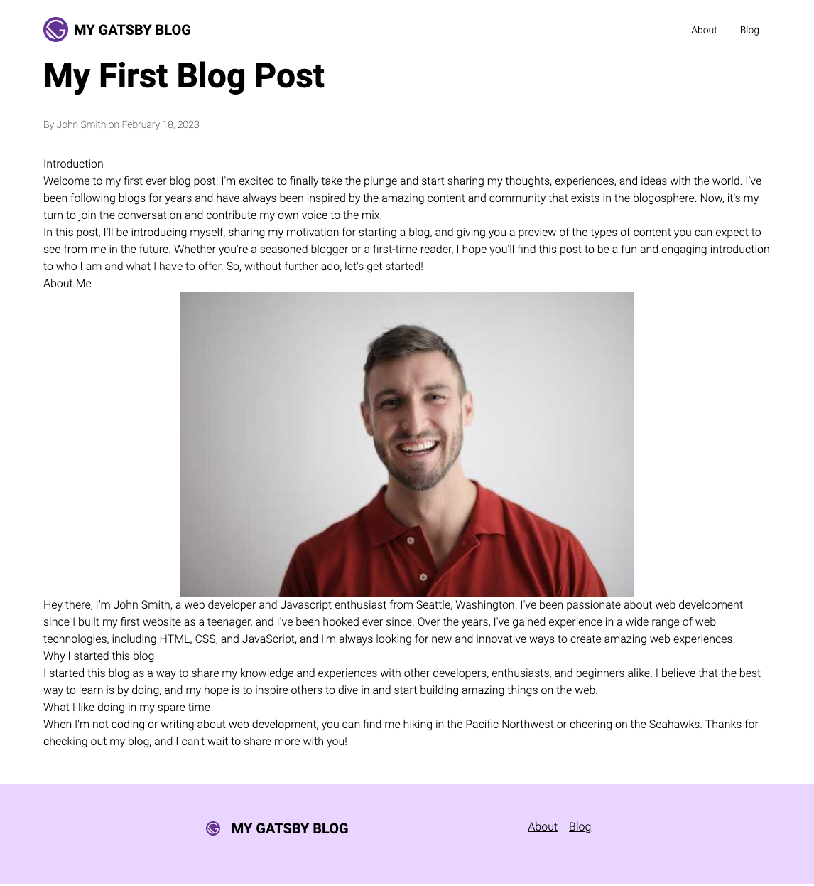
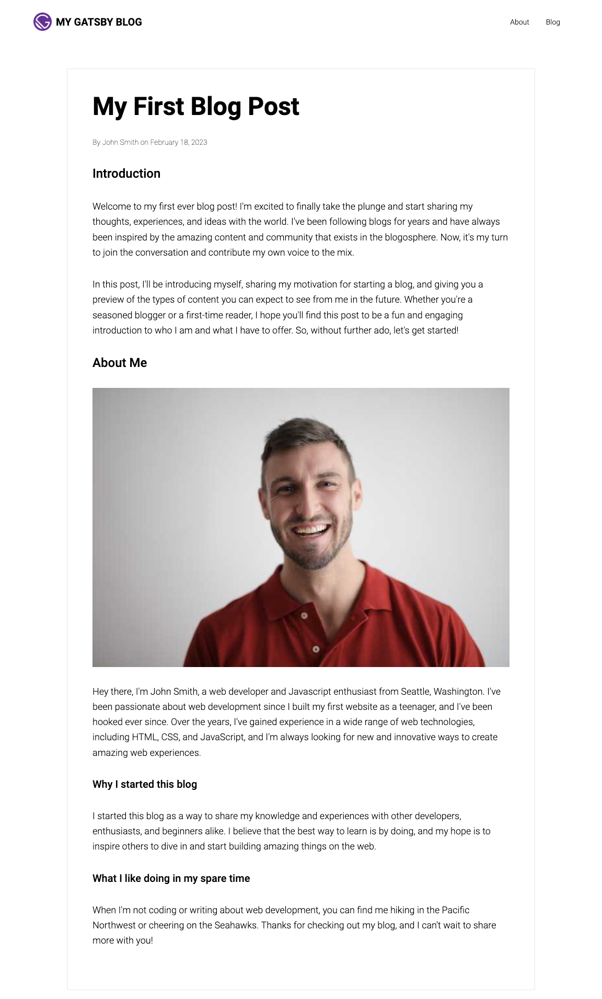
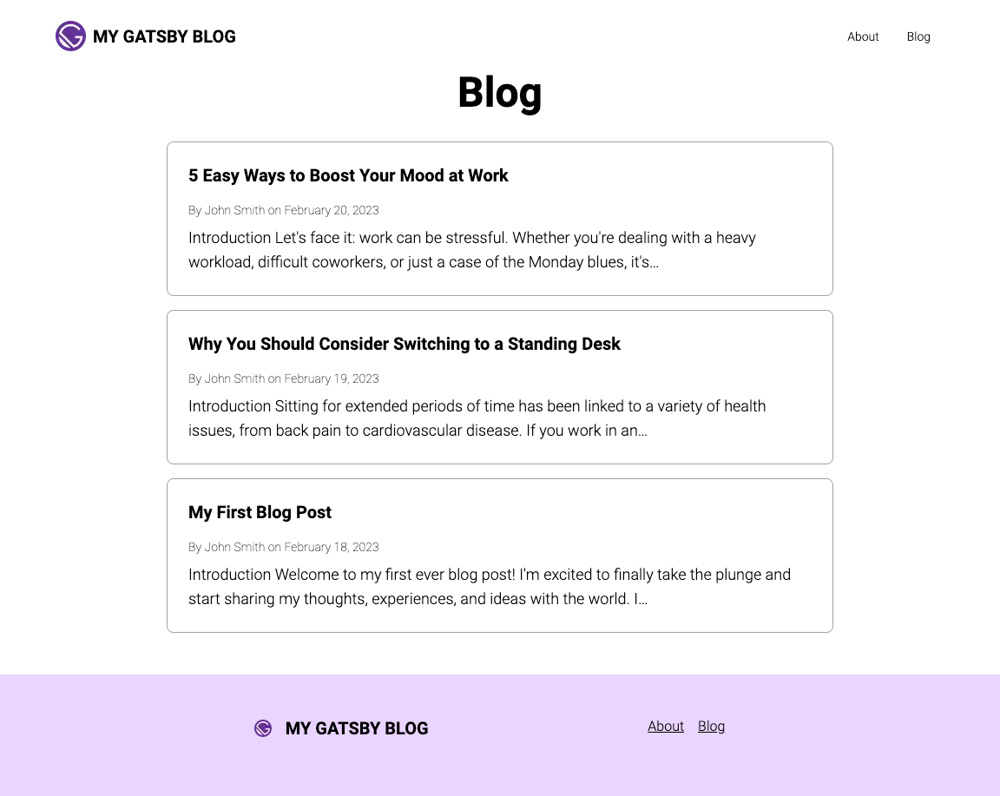

Welcome to part three of "Building a Gatsby Blog"! We've made significant progress in the previous parts of the series, creating the foundation of our blog with a "Layout" component and a few key pages. Now, we're ready to dive into the heart of our blog: the blog list and individual post pages.

In this part of the series, we'll be using MDX to define our blog pages. MDX is a powerful tool that allows us to create dynamic, interactive pages with Markdown and JSX. We'll also set up a blog list that will display all of our posts and individual pages for each post where readers can dive deeper into the content.

By the end of this post, you'll have a fully functional blog with a robust design, layout, and content. So, let's get started on "Building a Gatsby Blog: The Blog and Post Pages" and take your blogging journey to the next level! And remember to stay tuned for the rest of the series as we build and improve our blog.

import { GatsbyBlogSeriesPage } from '../../components/mdx-components';

<GatsbyBlogSeriesNavigation currentPage={GatsbyBlogSeriesPage.P3_BLOG_PAGES} />

## Using MDX for blog posts

MDX is a format that combines Markdown syntax, a popular way to write simple text that can be easily converted to HTML, with JSX, the syntax used in React applications to create reusable UI components. MDX enables users to create dynamic, interactive pages with Markdown and React, allowing developers to write and render components directly in their content.

For example, suppose you want to create a blog post with a code snippet that highlights a particular function. With MDX, you can easily create a React component that renders the code snippet and then include it in your Markdown content. Here's a simple example of an MDX file that demonstrates this concept:

```markdown
import CodeSnippet from "./CodeSnippet";

# My Blog Post

Here is some text introducing my blog post.

<CodeSnippet code={`function add(a, b) {
  return a + b;
}`} />
```

In this example, we're importing a `CodeSnippet` component to render a code block with some HTML. By including JSX within the Markdown content, we can easily create more complex and interactive pages.

### Adding MDX to Gatsby

We need to get our project set up to use MDX. But first, install the dependencies.

```bash
npm install @mdx-js/mdx @mdx-js/react gatsby-plugin-mdx \
  gatsby-remark-images gatsby-remark-copy-linked-files
```

> **NOTE**: We will also be using some Remark Gatsby plugins. Remark is a powerful markdown processor for JavaScript that makes it easy to parse, manipulate, and render Markdown content in your applications. We are going to combine Remark with MDX to get extra features like images and later a table of contents and other great stuff.

Next, open up `gatsby-config.ts` and add this configuration:

```typescript
// gatsby-config.ts

const config: GatsbyConfig = {
  "plugins": {
    {
      resolve: 'gatsby-source-filesystem',
      options: {
        name: 'images',
        path: './src/images/',
      },
      __key: 'images',
    },
    {
      resolve: 'gatsby-source-filesystem',
      options: {
        name: 'pages',
        path: './src/pages/',
      },
      __key: 'pages',
    },
    // ↓ Add This
    // highlight-start
    {
      resolve: 'gatsby-source-filesystem',
      options: {
        name: 'blog',
        path: './src/content',
      },
    },
    // highlight-end
    // ↓ REMOVE THIS
    'gatsby-plugin-mdx', // highlight-line
    // ↓ Add This
    // highlight-start
    {
      resolve: 'gatsby-plugin-mdx',
      options: {
        extensions: ['.md', '.mdx'],
        gatsbyRemarkPlugins: [
          'gatsby-remark-images',
          'gatsby-remark-copy-linked-files',
        ],
      },
    },
    // highlight-end
  }
}
```

> **NOTE**: \*\*MAKE SURE YOU REMOVE THE EXISTING 'gatsby-plugin-mdx' PLUGIN LINE! If you don't, you'll get strange errors

In the configuration above, we added a new `./src/content` filesystem route for Gatsby to process; this is where we will store our blog posts. We also set up MDX and added some Remark plugins to process images.

We will make a blog post by creating a new folder and adding an `index.mdx` file.

> **TIP**: We want to create a folder for each post containing the content and other assets like videos or images. With MDX, it's also possible we may want to create some custom React components inside this folder as well.

```bash
mkdir -p ./src/content/2023-02-18-01-00-00-my-first-blog-post
touch ./src/content/2023-02-18-01-00-00-my-first-blog-post/index.mdx
```

> **NOTE**: You can change the timestamp to whatever day it currently is as you follow along through this tutorial.

We will be adding an image to this blog post as well. The image can be anything you like. If you check out the GitHub branch for this article, you'll find the image I used, and you can certainly copy that image and use it. Otherwise, add your own picture.

```
mv ~/path/to/profile.jpg ./src/content/2023-02-18-01-00-00-my-first-blog-post/profile.jpg
```

Add this markdown to the `index.mdx` file:

```markdown
---
date: 2023-02-18 01:00:00
slug: my-first-blog-post
title: My First Blog Post
author: John Smith
---

## Introduction

Welcome to my first-ever blog post! I'm excited to finally take the plunge and
start sharing my thoughts, experiences, and ideas with the world. I've been
following blogs for years and have always been inspired by the amazing content
and community that exists in the blogosphere. Now, it's my turn to join the
conversation and contribute my own voice to the mix.

In this post, I'll be introducing myself, sharing my motivation for starting a
blog, and giving you a preview of the types of content you can expect to see
from me in the future. Whether you're a seasoned blogger or a first-time reader,
I hope you'll find this post to be a fun and engaging introduction to who I am
and what I have to offer. So, without further ado, let's get started!

## About Me


Hey there, I'm John Smith, a web developer and Javascript enthusiast from
Seattle, Washington. I've been passionate about web development since I built my
first website as a teenager, and I've been hooked ever since. Over the years,
I've gained experience in a wide range of web technologies, including HTML, CSS,
and JavaScript, and I'm always looking for new and innovative ways to create
amazing web experiences.

### Why I started this blog

I started this blog as a way to share my knowledge and experiences with other
developers, enthusiasts, and beginners alike. I believe that the best way to
learn is by doing, and my hope is to inspire others to dive in and start
building amazing things on the web.

### What I like doing in my spare time

When I'm not coding or writing about web development, you can find me hiking in
the Pacific Northwest or cheering on the Seahawks. Thanks for checking out my
blog, and I can't wait to share more with you!
```

> **NOTE**: That stuff at the top of the page wrapped inside the `---` marks is called "frontmatter." It's useful metadata about the blog post, and you can add all sorts of information there that will become available inside the React component for your blog post. So we'll be making use of frontmatter a lot.

## The blog post pages

Next, we will create the blog post pages.

### Create the BlogPostTemplate.tsx template file.

The `BlogPostTemplate.tsx` file is a template file. We are going to use it below in `gatsby-node.ts` to programmatically create our blog posts from a GraphQL query. The template will be passed an id and the blog post data.

```bash
mkdir ./src/templates
touch ./src/templates/BlogPostTemplate.tsx
```

```typescript
// ./src/templates/BlogPostTemplate.tsx
import { MDXProvider } from '@mdx-js/react';
import { graphql, PageProps } from 'gatsby';
import React from 'react';
import { PageLayout } from '../components/page-layout';

const BlogPostTemplate: React.FC<PageProps<Queries.BlogPostQuery>> = ({
  data,
  children, // ← This is the post content
}) => {
  return (
    <PageLayout>
      <h1 className="mb-8 text-4xl font-bold sm:text-5xl">
        {data.mdx?.frontmatter?.title}
      </h1>
      <div className="mb-8">
        <span className="text-sm font-thin">
          By {data.mdx?.frontmatter?.author} on {data.mdx?.frontmatter?.date}
        </span>
      </div>
      <MDXProvider>{children}</MDXProvider>
    </PageLayout>
  );
};

export default BlogPostTemplate;

export const query = graphql`
  query BlogPost($id: String!) {
    mdx(id: { eq: $id }) {
      frontmatter {
        title
        author
        date(formatString: "MMMM DD, YYYY")
      }
    }
  }
`;
```

### Create gatsby-node.ts

We will be using the API available to us in `gatsby-node.ts`. This file gives us programmatic access to the page creation for our blog. We are going to leverage its power to create our blog posts and our blog list page.

```bash
touch gatsby-node.ts
```

```typescript
// gatsby-node.ts
import { CreatePagesArgs } from 'gatsby';
import path from 'path';

exports.createPages = async ({
  graphql,
  actions,
  reporter,
}: CreatePagesArgs) => {
  const { createPage } = actions;

  const BlogPostTemplate = path.resolve('./src/templates/BlogPostTemplate.tsx');

  const result = await graphql<Queries.GatsbyNodeCreatePagesQuery>(
    `
      query GatsbyNodeCreatePages {
        allMdx {
          nodes {
            id
            frontmatter {
              slug
            }
            internal {
              contentFilePath
            }
          }
        }
      }
    `
  );

  if (result.errors) {
    reporter.panicOnBuild(
      'There was an error loading the MDX result',
      result.errors
    );
  }

  result.data?.allMdx.nodes.forEach((node) => {
    createPage({
      path: `/blog/${node.frontmatter?.slug}`,
      component: `${BlogPostTemplate}?__contentFilePath=${node.internal.contentFilePath}`,
      context: { id: node.id },
    });
  });
};
```

> **NOTE**: The `component` attribute at the bottom may look weird. [Check out the documentation](https://www.gatsbyjs.com/docs/how-to/routing/mdx/#make-a-layout-template-for-your-posts) for an explanation as to why it looks like this.

### Styling the blog posts

Let's step back and see what our site looks like now.



Well, the content is all there. But it isn't styled yet, and it doesn't look pleasant. Let's fix that.

The MDX system, `@mdx-js/react`, has a provider we use in the `BlogPostTemplate` component called `MdxProvider`. We will create some styles and pass them to the provider, so it knows how to appropriately style our content.

> **NOTE**: If you want to learn more about the styling options available to the `MdxProvider` provider component, [here is a link to the documentation](https://www.gatsbyjs.com/docs/how-to/routing/mdx/#make-components-available-globally-as-shortcodes).

We will define our styles in a new module located in our `components` directory:

```bash
mkdir -p ./components/mdx-components/components
touch ./components/mdx-components/index.ts
touch ./components/mdx-components/styles.tsx
touch ./components/mdx-components/components/MainContent.tsx
```

> **NOTE**: We are creating a folder to contain our mdx styles and components because, in subsequent parts of this series, we will define custom components to use with MDX, and keeping them all in one place is a good organizational practice.

```typescript
// ./src/components/mdx-components/index.ts
export * from './styles';
export * from './components/MainContent';
```

```typescript
// ./src/components/mdx-components/styles.tsx
import styled from '@emotion/styled';
import tw from 'twin.macro';

const H1 = styled.h1`
  ${tw`mb-8 text-3xl font-medium uppercase`};
`;

const H2 = styled.h2`
  ${tw`mb-8 text-2xl font-medium`}
`;

const H3 = styled.h3`
  ${tw`mb-8 text-xl font-medium`};
`;

const H4 = styled.h4`
  ${tw`mb-4 uppercase text-sm font-bold`}
`;

const H5 = styled.h5`
  ${tw`font-bold text-sm`}
`;

const Paragraph = styled.p`
  ${tw`mb-8 text-lg leading-relaxed`};
`;

const Blockquote = styled.blockquote`
  ${tw`pl-4 text-gray-700 border-l-2 border-blue-200`}
`;

const UnorderedList = styled.ul`
  ${tw`pl-5 mb-8 list-disc`}

  > li {
    ${tw`mb-4`}
  }
`;

const OrderedList = styled.ol`
  ${tw`pl-5 mb-8 list-decimal`}

  > li {
    ${tw`mb-4`}
  }
`;

const ListElement = styled.li`
  ${tw`text-lg`}
  > p {
    ${tw`mb-0`};
  }
  > blockquote {
    ${tw`mt-4`}
  }
`;

const Anchor = styled.a`
  ${tw`underline text-blue-500`};
`;

export const components = {
  h1: H1,
  h2: H2,
  h3: H3,
  h4: H4,
  h5: H5,
  p: Paragraph,
  ol: OrderedList,
  ul: UnorderedList,
  li: ListElement,
  a: Anchor,
  blockquote: Blockquote,
};
```

> **NOTE**: In the above styles, we use the `styled` utility from `@emotion/styled` and the `twin.macro` utility. The `twin.macro` utility allows us to define Tailwind classes in Emotion-based styles.

```typescript
// ./src/components/mdx-components/components/MainContent.tsx
import styled from '@emotion/styled';
import tw from 'twin.macro';

export const MainContent = styled.article`
  ${tw`max-w-4xl px-4 py-12 mx-auto my-12 text-black lg:border lg:border-gray-200 lg:p-12`};

  &&& {
    .gatsby-resp-image-wrapper {
      ${tw`w-full mb-8`};
      max-width: 100% !important;
      margin-left: 0 !important;
      margin-right: 0 !important;

      img {
        object-fit: cover;
      }
    }
  }
`;
```

> **NOTE**: The `MainContent` component will wrap our content with some "global" styles. We're using the `styled` utility from `@emotion/styled` to add some arbitrary CSS to target our gatsby images and ensure they look good on our blog. Feel free to tweak the CSS above to your liking!

Now we can add these styles to our `BlogPostTemplate` component's `MdxProvider`:

```typescript {1,2,3-4}
// ./src/templates/BlogPostTemplate.tsx
import { MDXProvider } from '@mdx-js/react';
import { graphql, PageProps } from 'gatsby';
import React from 'react';
// ↓ Add This
import { components, MainContent } from '../components/mdx-components'; // highlight-line
import { PageLayout } from '../components/page-layout';

const BlogPostTemplate: React.FC<PageProps<Queries.BlogPostQuery>> = ({
  data,
  children,
}) => {
  return (
    <PageLayout>
      // ↓ Add This // highlight-start
      <MainContent>
        // highlight-end
        <h1 className="mb-8 text-4xl font-bold sm:text-5xl">
          {data.mdx?.frontmatter?.title}
        </h1>
        <div className="mb-8">
          <span className="text-sm font-thin">
            By {data.mdx?.frontmatter?.author} on {data.mdx?.frontmatter?.date}
          </span>
        </div>
        // ↓ Update This
        <MDXProvider components={components}>{children}</MDXProvider> //
        highlight-line
      </MainContent>
    </PageLayout>
  );
};

export default BlogPostTemplate;

export const query = graphql`
  query BlogPost($id: String!) {
    mdx(id: { eq: $id }) {
      frontmatter {
        title
        author
        date(formatString: "MMMM DD, YYYY")
      }
    }
  }
`;
```

Let's see what it looks like now:



Much better!

## The blog list page

So far, we have a mechanism to create our blog post pages. But we still need a main blog page that lists all our posts.

Let's dive into that!

Here's how to set up the blog list page:

```bash
touch ./src/pages/blog.tsx
```

```typescript
import { graphql, Link, PageProps } from 'gatsby';
import React from 'react';
import { PageLayout } from '../components/page-layout';

const BlogPage: React.FC<PageProps<Queries.BlogPageQuery>> = ({ data }) => {
  return (
    <PageLayout>
      <h1 className="mb-8 text-center text-4xl font-bold sm:text-5xl">Blog</h1>
      <ul className="mx-auto max-w-3xl p-4 sm:p-0">
        {data.allMdx.edges.map(({ node }) => (
          <li key={node.id} className="mb-4 last-of-type:mb-0">
            <Link
              to={`/blog/${node.frontmatter?.slug}`}
              className="block rounded-lg border border-gray-400 p-6"
            >
              <h2 className="mb-4 text-xl font-bold">
                {node.frontmatter?.title}
              </h2>
              <span className="mb-2 block text-sm font-thin">
                By {node.frontmatter?.author} on {node.frontmatter?.date}
              </span>
              <span className="block text-lg">{node.excerpt}</span>
            </Link>
          </li>
        ))}
      </ul>
    </PageLayout>
  );
};

export default BlogPage;

export const query = graphql`
  query BlogPage {
    allMdx(sort: { frontmatter: { date: DESC } }) {
      edges {
        node {
          id
          excerpt(pruneLength: 160)
          frontmatter {
            title
            author
            date(formatString: "MMMM DD, YYYY")
            slug
          }
        }
      }
    }
  }
`;
```

And this is what the `localhost:8000/blog/` page looks like:



> **NOTE**: I added a few more blog posts to make it look more "alive." Thanks, chatGPT!

## Conclusion

In this post, we've made significant progress on our GatsbyJS blog by adding MDX processing, creating the blog post pages, and setting up the blog list page. We covered a lot of ground and introduced some new concepts along the way, so if you have any questions or need clarification, please don't hesitate to reach out in the comments.

As we build our blog, the next step is adding a featured image to each blog post. This will help give our blog a more professional look and make our content more engaging for readers. So stay tuned for the next installment: [Building a Gatsby Blog: Layout and Featured Images](/blog/2023-02-21-p4-gatsby-js-blog-featured-image/).

And, here is the source code for this post: [MachineServant GitHub: Build a Gatsby Blog (part 3)](https://github.com/Machine-Servant/build-a-gatsby-blog-series/tree/blog/p1-project-setup)

<GatsbyBlogSeriesNavigation currentPage={GatsbyBlogSeriesPage.P3_BLOG_PAGES} />
