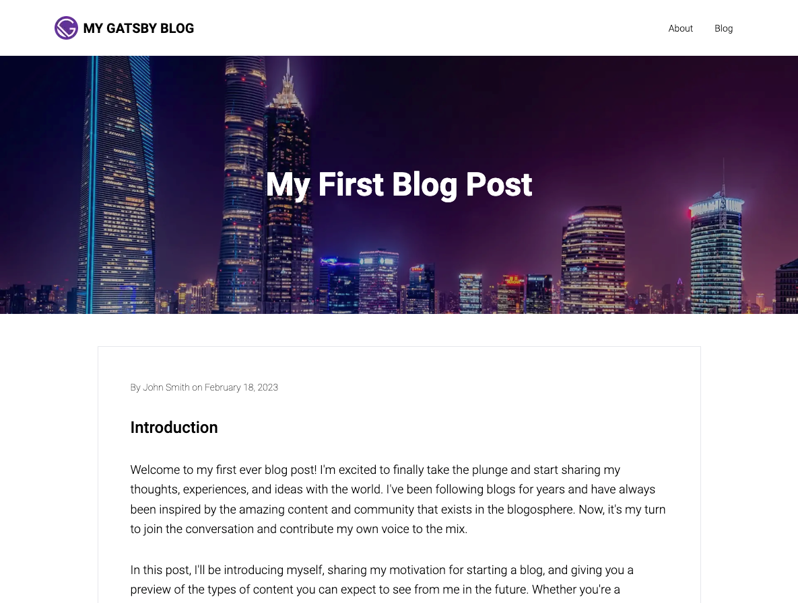

Welcome to part four of "Building a GatsbyJS Blog!" In this post, we'll continue building a beautiful and fully functional blog with GatsbyJS. In the previous installment, we produced our blog's foundation by creating a "Layout" component that provides a cohesive and consistent design across all pages. Now, we're ready to take our blog to the next level by adding featured images.

Featured images are an essential part of any blog as they help to draw the reader's attention and make your content more visually engaging. In this post, we'll show you how to add images to the Layout component we created in part two of the series. We'll also show you how to define unique images for each blog post using the frontmatter of the post's MDX file. With these techniques, you'll be able to create a visually stunning and professional-looking blog that stands out from the crowd. So let's get started!

import { GatsbyBlogSeriesPage } from '../../components/mdx-components';

<GatsbyBlogSeriesNavigation
  currentPage={GatsbyBlogSeriesPage.P4_FEATURED_IMAGES}
/>

## Adding featured images to main pages

Every page in our blog will have an image above the main content, right below the main navigation bar. The idea is to give a splash of color and something to catch the reader's eye. The featured image is also critical for blog posts as you want to have that image appear in Twitter and Facebook posts when you start doing search engine optimization.

> **NOTE**: An image before the main content is a classic look for websites and blogs. But you may decide it's too dated or has lousy SEO, which is totally cool. So I'm not necessarily advocating for this style (although I [use it on my own website](https://www.machineservant.com/)).

### PageLayout updates

Open up the `./src/components/PageLayout.tsx` file and modify it as such:

```typescript
// ./src/components/PageLayout.tsx
import { GatsbyImage, IGatsbyImageData } from 'gatsby-plugin-image'; // highlight-line
import React from 'react';
import { PageFooter } from '../page-footer';
import { PageHeader } from '../page-header';

// highlight-start
interface PageLayoutProps {
  image?: IGatsbyImageData | null;
  title?: string;
}
// highlight-end

// highlight-start
export const PageLayout: React.FC<React.PropsWithChildren<PageLayoutProps>> = ({
  children,
  image,
  title,
}) => {
  // highlight-end
  return (
    <main className="font-sans font-light">
      <PageHeader />
      // highlight-start
      {image && (
        <div className="relative mb-12 flex h-96 items-center justify-center">
          <GatsbyImage image={image} alt="" className="absolute inset-0" />
          {title && (
            <div className="z-20 mx-auto max-w-5xl">
              <h1 className="text-4xl font-bold text-white sm:text-5xl">
                {title}
              </h1>
            </div>
          )}
          {/* Darken the background image a little so the text shows up better */}
          <div className="absolute inset-0 z-10 bg-gray-900 opacity-30" />
        </div>
      )}
      // highlight-end
      <div className="mx-auto mb-12 max-w-5xl">{children}</div>
      <PageFooter />
    </main>
  );
};
```

### Find an image

We will pass the image data and the page title to the layout component from our pages.

But before we do that, we will have to find an image and put it in our `./src/images` folder. So go ahead and locate a nice picture. For example, I use [Pexels](https://www.pexels.com) for many of my stock images.

Once you find an image, move it over to the `./src/images` directory:

```bash
mv /path/to/downloaded/image.jpg ./src/images/header.jpg
```

### Update the Home page

Now we are ready to start adding the image to our pages. Let's start with the "Home" page.

```typescript
// ./src/pages/index.tsx
import { graphql, HeadFC, PageProps } from 'gatsby';
import { getImage } from 'gatsby-plugin-image'; // highlight-line
import * as React from 'react';
import { PageLayout } from '../components/page-layout';

const IndexPage: React.FC<PageProps<Queries.IndexPageQuery>> = ({ data }) => {
  // highlight-line
  // highlight-start
  const image = data.headerImage
    ? getImage(data.headerImage.childImageSharp)
    : null;
  // highlight-end

  return (
    <PageLayout image={image} title="My Gatsby Blog">
      {' '}
      // highlight-line
      <div className="container mx-auto px-4 lg:px-0">
        <span className="text-lg">This is my Gatsby Blog home page!</span>
      </div>
    </PageLayout>
  );
};

export default IndexPage;

// highlight-start
// This query will be run during the GatsbyJS build process when creating our
// pages. The data will be passed to our page component as a `data` property.
export const pageQuery = graphql`
  query IndexPage {
    headerImage: file(relativePath: { eq: "header.jpg" }) {
      childImageSharp {
        gatsbyImageData(layout: FULL_WIDTH)
      }
    }
  }
`;
// highlight-end

export const Head: HeadFC = () => <title>Home Page</title>;
```

> **NOTE**: The `relativePath` file name argument needs to match the file name of the file you added to the `./src/images` folder. So, double-check that you've got that file name correct.

After the development server updates, you should see a home page that looks something like this:


To get the same result on your "About" page and "Blog List" pages, do the same thing we did above to the `.src/pages/about.tsx` and `./src/pages/blog.tsx` page components.

> **TIP**: If you want different images for each page, download additional images and move them to the `./src/images` folder. Then, update the `pageQuery` for each page component to gather the correct image data by updating the `relativePath` accordingly.

## Adding blog post featured images

So far, we have updated our main pages to show featured images. Now we want to add featured images to all of our blog posts.

The trick is that we can't define the featured image using a `pageQuery` as we did for our main pages since we're using MDX to generate these pages.

This is where the frontmatter for each blog post comes in. We will use the frontmatter section of each MDX file to define a `featuredImage` property and use that property to find the image and display it in the blog post.

### Update the frontmatter

Update each of your blog post MDX files with frontmatter that looks like this:

```markdown
---
date: 2023-02-18 01:00:00
slug: my-first-blog-post
title: My First Blog Post
author: John Smith
featuredImage: ./featured.jpg //highlight-line
---
```

> **NOTE**: Make sure to add this to each of your blog posts.

After adding the markdown, you probably need to restart the development server to ensure the frontmatter is parsed correctly.

### Add some image files.

Obviously, you'll need to have image files before you see any images! So, again, go find some lovely pictures from your favorite stock image site.

Once you have downloaded a few images, add them to the blog post directory:

```bash
mv /path/to/downloaded/image.jpg .src/content/<blog-directory>/featured.jpg
```

> **NOTE**: You'll want to ensure you have an image for each of your posts; otherwise, you might see some errors when GatsbyJS is building your queries.

### Update BlogPostTemplate.tsx

We have updated the frontmatter to our blog posts and added images to each blog post folder. All we have to do now is hook things up.

Open up the `./src/templates/BlogPostTemplate.tsx` file and update it as follows:

```typescript
// ./src/templates/BlogPostTemplate.tsx
import { MDXProvider } from '@mdx-js/react';
import { graphql, PageProps } from 'gatsby';
import { getImage } from 'gatsby-plugin-image'; // highlight-line
import React from 'react';
import { components, MainContent } from '../components/mdx-components';
import { PageLayout } from '../components/page-layout';

const BlogPostTemplate: React.FC<PageProps<Queries.BlogPostQuery>> = ({
  data,
  children,
}) => {
  // highlight-start
  const featuredImage = data.mdx?.frontmatter?.featuredImage
    ? getImage(data.mdx.frontmatter.featuredImage.childImageSharp)
    : null;
  // highlight-end

  return (
    // highlight-start
    <PageLayout
      image={featuredImage}
      title={data.mdx?.frontmatter?.title ?? undefined}
    >
      // highlight-end
      <MainContent>
        <div className="mb-8">
          <span className="text-sm font-thin">
            By {data.mdx?.frontmatter?.author} on {data.mdx?.frontmatter?.date}
          </span>
        </div>
        <MDXProvider components={components}>{children}</MDXProvider>
      </MainContent>
    </PageLayout>
  );
};

export default BlogPostTemplate;

export const query = graphql`
  query BlogPost($id: String!) {
    mdx(id: { eq: $id }) {
      frontmatter {
        title
        author
        date(formatString: "MMMM DD, YYYY")
        // highlightstart
        featuredImage {
          childImageSharp {
            gatsbyImageData(layout: FULL_WIDTH)
          }
        }
        // highlightend
      }
    }
  }
`;
```

If you navigate to a blog post, you should now see the featured image!



## Show images in the blog list

The last thing we want to do is update our blog list so that each post shows a preview of the featured image.

### Update the blog page

We will update the query in our `./src/pages/blog.tsx` page component to do this.

```typescript
// ./src/pages/blog.tsx
import { graphql, Link, PageProps } from 'gatsby';
import { GatsbyImage, getImage } from 'gatsby-plugin-image';
import React from 'react';
import { PageLayout } from '../components/page-layout';

const BlogPage: React.FC<PageProps<Queries.BlogPageQuery>> = ({ data }) => {
  const headerImage = data.headerImage
    ? getImage(data.headerImage.childImageSharp)
    : null;

  return (
    <PageLayout image={headerImage} title="Blog">
      <ul className="mx-auto max-w-3xl p-4 sm:p-0">
        {data.allMdx.edges.map(({ node }) => (
          // highlight-start
          <li key={node.id} className="mb-4 h-72 last-of-type:mb-0">
            <Link
              to={`/blog/${node.frontmatter?.slug}`}
              className="flex items-center overflow-hidden rounded-lg border border-gray-400"
            >
              <div className="flex-1 md:h-72 md:w-64">
                {node.frontmatter?.featuredImage && (
                  <GatsbyImage
                    image={
                      getImage(node.frontmatter.featuredImage.childImageSharp)!
                    }
                    alt=""
                    className="h-full w-full"
                  />
                )}
              </div>
              <div className="flex-1 p-6">
                <h2 className="mb-4 text-xl font-bold">
                  {node.frontmatter?.title}
                </h2>
                <span className="mb-2 block text-sm font-thin">
                  By {node.frontmatter?.author} on {node.frontmatter?.date}
                </span>
                <span className="block text-lg">{node.excerpt}</span>
              </div>
            </Link>
          </li>
          // highlight-end
        ))}
      </ul>
    </PageLayout>
  );
};

export default BlogPage;

export const query = graphql`
  query BlogPage {
    headerImage: file(relativePath: { eq: "header.jpg" }) {
      childImageSharp {
        gatsbyImageData(layout: FULL_WIDTH)
      }
    }
    allMdx(sort: { frontmatter: { date: DESC } }) {
      edges {
        node {
          id
          excerpt(pruneLength: 160)
          frontmatter {
            title
            author
            date(formatString: "MMMM DD, YYYY")
            slug
            // highlightstart
            featuredImage {
              childImageSharp {
                gatsbyImageData(layout: FULL_WIDTH)
              }
            }
            // highlightend
          }
        }
      }
    }
  }
`;
```

After those changes, your blog list page should look something like this:


## Conclusion

With the addition of featured images to our GatsbyJS blog, we've taken a big step forward in creating a visually stunning and engaging platform for our readers. In addition, by using GraphQL queries to source images from our local filesystem and display them on our blog pages, we've also gained a deeper understanding of the power and flexibility of GatsbyJS.

As we continue to build our blog, there will be many new challenges and opportunities to explore. In the next installment of "Building a GatsbyJS Blog," we'll discuss search engine and social media optimization. This will include topics such as metadata, sitemaps, and Open Graph tags, which are crucial for maximizing our blog's visibility and reach.

We hope you've followed along and feel inspired to build your blog using GatsbyJS. If you have any questions or feedback, please don't hesitate to ask in the comments. And be sure to stay tuned for the next installment of the series, where we'll cover even more exciting GatsbyJS topics!

Here is the source code for this post: [MachineServant GitHub: Build a Gatsby Blog (part 4)](https://github.com/Machine-Servant/build-a-gatsby-blog-series/tree/blog/p4-featured-images)

<GatsbyBlogSeriesNavigation
  currentPage={GatsbyBlogSeriesPage.P4_FEATURED_IMAGES}
/>
