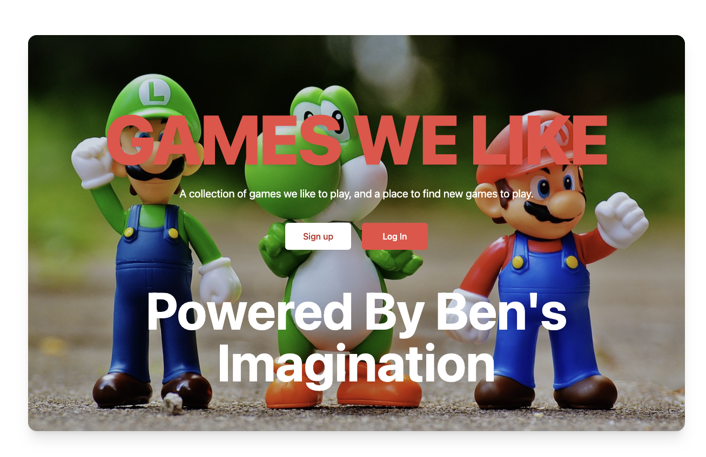

We're using the "indie stack" from Remix. But I always need to customize the defaults because I'm difficult. I really should create my own stack to make this easier on myself in the future.

I like to use the supa fly stack's module system as a starting point. I like "supa fly stack." However, it uses "supabase," which I'm not using here, so I will steal what I want from it and move on.

## Things to do:

- Remove the "notes" services
- Remove the "notes" routes
- Update the Prisma schema to remove "notes"
- Update links to "notes" to point to "games"
- Tweak some of the content
- Update the seed
- Create migrations
- Refactor into modules
- Update tests
- Make sure everything runs
- Deploy!

## Step 1:Remove some files

I removed these files:

- `~/app/routes/notes.tsx`
- `~/app/routes/notes.new.tsx`
- `~/app/routes/notes._index.tsx`
- `~/app/routes/notes.$noteId.tsx`
- `~/models/note.server.ts`

Doing this surgery didn't break as much as you might think. Mostly I fixed up some references to "notes" throughout the code by updating links to the "notes" pages to point to a future "games" page.

## Create a stub route.

We're going to have a `/games` route. I will create it now to make things easier later on. Currently, it is elementary, has a "logout" link, and displays nothing.

```tsx
import type { LoaderArgs } from '@remix-run/node';
import { json, redirect } from '@remix-run/node';
import { Form, Link } from '@remix-run/react';
import { getUserId } from '~/session.server';
import { useUser } from '~/utils';

export const loader = async ({ request }: LoaderArgs) => {
  const userId = await getUserId(request);
  if (!userId) return redirect('/login');
  return json({});
};

export default function Games() {
  const user = useUser();

  return (
    <div className="flex h-full min-h-screen flex-col">
      <header className="flex items-center justify-between bg-slate-800 p-4 text-white">
        <h1 className="text-3xl font-bold">
          <Link to="/games">Games</Link>
        </h1>
        <p>{user.email}</p>
        <Form method="post" action="/logout">
          <button
            type="submit"
            className="rounded bg-slate-600 px-4 py-2 text-blue-100 hover:bg-blue-500 active:bg-blue-600"
          >
            Logout
          </button>
        </Form>
      </header>
    </div>
  );
}
```

## Fix tests

Our tests broke, though!

I expected that. But I will fix these issues as they crop up so they don't snowball on me.

These tests needed to be updated:

- `~/cypress/smoke.cy.ts`

I removed the "create a new note" test and updated the "register and login" test so it navigates to the new `/games` route rather than the `/notes` route.

Since we added the `/games` stub route and ensured there was a "logout" button on the page, the tests ran successfully!

## Update the Prisma Schema and Seed

As we remove all references to "notes," we must remove the Prisma database schema for "notes" and the associated seeds.

Files updated:

- `~/prisma/schema.prisma`
- `~/prisma/seed.ts`

I removed the "notes" schema and deleted the "notes[]" reference from "user."

I removed the seeded note entries.

Finally, I ran `prisma migrate dev`, which created a migration to apply my changes.

## Clean up the UI a little

We need to update the UI to reflect the new "games" theme. I will do this in a few steps.

First, I want a picture that Ben will like and has something to do with his favorite game, "Super Mario World." Next, I want to update the colors to match the picture. Finally, I want to update the content to be more relevant to games.



I think that looks pretty good. I'm not a designer, but I think it's a good start.

## Modularize!

I like the way the "supa fly stack" is organized. I will use it as a starting point for my own code organization.

Basically, each module will encompass a set of related functionality. For example, a "user" module will handle all the user-related functionality, and an "auth" module will handle all the authentication-related functionality.

You can see the final code here [on GitHub](https://github.com/Machine-Servant/ben-app)

You can see the final app here [on Fly.io](https://ben-app.fly.dev/)

Join me for the [next article](/blog/2023-07-07-p3-remix-games-app-tutorial) in this series, where we will a side menu!
