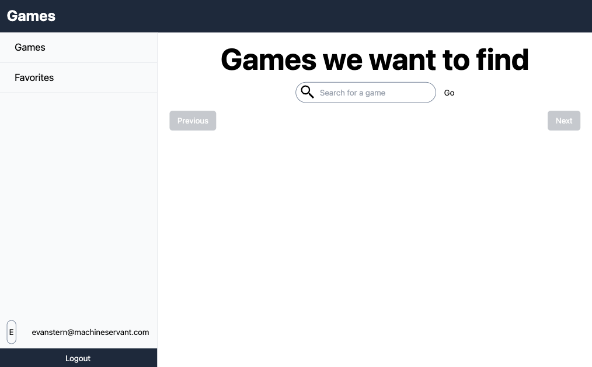
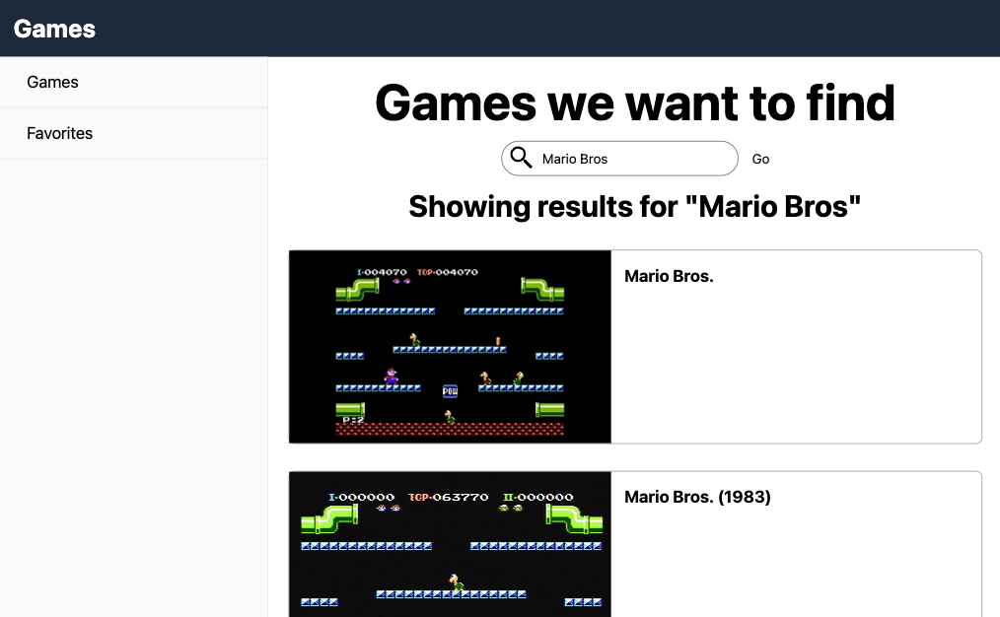
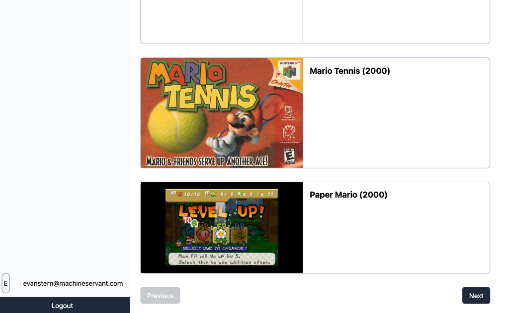

Ben likes to play video games. He wants to be able to search for games and add them to his list of games. We'll need to add a search bar to our app, and then we'll need to display the results of the search. Ben likes pictures, so we'll need to make sure we display pictures of the games.

Apparently, he told his parents he wants this app to run on his iPad, so we'll need to make sure it's responsive.

In this tutorial, we'll be adding a search bar to our app. We'll be using the [RAWG API](https://rawg.io/apidocs) to search for games.

## First Things First

We have to do a few chores before we move on to the fun stuff.

### Get a RAWG API Key

In order to use the RAWG API, we'll need to get an API key. You can get one [here](https://rawg.io/apidocs). Once you have your API key, you'll need to add it to your `.env` file.

```bash
# .env
RAWG_API_KEY=YOUR_API_KEY
```

If you want this to work in production, you'll need to add your API key to your production environment variables as well.

### Install Some Dependencies

I'm going to make use of the Radix [Form](https://www.radix-ui.com/docs/primitives/components/form) library to build the search bar. Radix is a collection of React components that are built with accessibility in mind.

```bash
npm add @radix-ui/react-form@latest -E
```

## Searching for Games

In order to search for games, we need a search bar! Again, we want to make sure all of this looks good on small and large screens, so we'll be using Tailwind's responsive classes.

### The Search Bar

The search bar itself lives in the `~/routes/games._index.tsx` file. We want to display the search bar at the top of the page.

```tsx
// ~/routes/games._index.tsx

// ... imports

export const loader = async ({ request }: LoaderArgs) => {
  const userId = await getUserId(request);
  if (!userId) return redirect('/login');

  const url = new URL(request.url);
  const searchTerm = url.searchParams.get('search');

  return json({
    searchTerm,
  });
};

export default function GamesPage() {
  const navigation = useNavigation();
  const { searchTerm } = useLoaderData<typeof loader>() || {};

  return (
    <div className="flex-1 p-6">
      <h1 className="text-center text-3xl font-bold sm:text-6xl">
        Games we want to find
      </h1>
      <div className="mt-4">
        <Form
          method="get"
          action="/games?index"
          className="flex flex-col items-center"
        >
          <ReactForm.Root asChild>
            <ReactForm.Field
              name="search"
              className="relative flex w-80 items-center gap-4"
            >
              <SearchIcon className="absolute left-2 top-1 h-8 w-8 fill-black" />
              <ReactForm.Control
                type="text"
                placeholder="Search for a game"
                defaultValue={searchTerm || ''}
                className="flex-1 rounded-full border border-slate-500 py-2 pl-12 pr-4"
              />
              <ReactForm.Submit
                className="disabled:opacity-25"
                disabled={navigation.state === 'submitting'}
              >
                Go
              </ReactForm.Submit>
            </ReactForm.Field>
          </ReactForm.Root>
        </Form>
      </div>
      <div className="mt-4 flex flex-1 flex-col">
        {searchTerm && (
          <h2 className="mb-8 text-center text-2xl font-bold sm:text-4xl">
            Showing results for "{searchTerm}"
          </h2>
        )}
      </div>
    </div>
  );
}
```

We're using the `useLoaderData` hook to get the search term from the query string. We're also using the `useNavigation` hook to disable the submit button while the form is submitting.

The form itself is built using the `Form`, `Root`, `Field`, `Control`, and `Submit` components from Radix. We're using the `asChild` prop on the `Root` component so that it plays nicely with Remix's `Form` component. Notice that the Remix `Form` component is submitting to the `/games?index` route. That's this route. Which means when the form is submitted, the `loader` function will be called.

The `loader` function doesn't do much yet, all it's doing is pulling the `search` query parameter out of the URL and returning it as the `searchTerm` property on the `json` object. We'll use this to display the search term on the page and to give the search box a default value.

### Some Types

Let's create a few types to help us out. I won't put the whole file here, but I'll link them below:

- [Game](https://github.com/Machine-Servant/ben-app/blob/ben-app-blog-part-4/app/modules/games/types.ts)
- [RawgListResponse](https://github.com/Machine-Servant/ben-app/blob/ben-app-blog-part-4/app/types.ts)

We'll use these types to help us define the `loader` function.

### The Search Function

Now that we have a search bar, we need to actually search for games. We'll use the `searchForGames` function to do that. This function lives in the `~/app/modules/games/service.server.ts` file.

```ts
// ~/app/modules/games/service.server.ts
import type { RawgListResponse } from '~/types';
import type { Game } from './types';

export async function searchForGames(
  searchTerm: string
): Promise<RawgListResponse<Game>> {
  const response = await fetch(
    `https://api.rawg.io/api/games?key=${process.env.RAWG_API_KEY}&search=${searchTerm}&parent_platforms=7`,
    {
      method: 'GET',
    }
  );
  const json = (await response.json()) as RawgListResponse<Game>;
  return json;
}
```

This function is pretty simple. It takes a `searchTerm` and uses it to search for games on the RAWG API. It returns a `Promise` that resolves to a `RawgListResponse<Game>`.

Note that we're limiting the search to games that are available on the Nintendo platform (`parent_platform=7`). This is because Ben likes Nintendo above all other platforms, so why waste search results on anything else?

### Display the Games Already!

Yep, now it's time to display the games. Sorry for the delay. We'll do that in the `~/routes/games._index.tsx` file.

You can find the full file [here](https://github.com/Machine-Servant/ben-app/blob/ben-app-blog-part-4/app/routes/games._index.tsx)

First, let's look at the `loader` function:

```tsx
// ~/routes/games._index.tsx
export const loader = async ({ request }: LoaderArgs) => {
  const userId = await getUserId(request);
  if (!userId) return redirect('/login');

  const url = new URL(request.url);
  const searchTerm = url.searchParams.get('search');

  let games;
  if (searchTerm) {
    games = await searchForGames(searchTerm);
  }

  return json({
    searchTerm,
    games,
  });
};
```

This is pretty simple. If the `searchTerm` exists in the parameters, we call the `searchForGames` function and return the results. Otherwise, we just return the `searchTerm` and `games` as `undefined`.

Now we can look at the `GamesPage` component itself:

```tsx
// ~/routes/games._index.tsx
export default function GamesPage() {
  const navigation = useNavigation();
  const { searchTerm, games } = useLoaderData<typeof loader>() || {};

  return (
    <div className="flex-1 p-6">
      <h1 className="text-center text-3xl font-bold sm:text-6xl">
        Games we want to find
      </h1>
      <div className="mt-4">
        <Form
          method="get"
          action="/games?index"
          className="flex flex-col items-center"
        >
          <ReactForm.Root asChild>
            <ReactForm.Field
              name="search"
              className="relative flex w-80 items-center gap-4"
            >
              <SearchIcon className="absolute left-2 top-1 h-8 w-8 fill-black" />
              <ReactForm.Control
                type="text"
                placeholder="Search for a game"
                defaultValue={searchTerm || ''}
                className="flex-1 rounded-full border border-slate-500 py-2 pl-12 pr-4"
              />
              <ReactForm.Submit
                className="disabled:opacity-25"
                disabled={navigation.state === 'submitting'}
              >
                Go
              </ReactForm.Submit>
            </ReactForm.Field>
          </ReactForm.Root>
        </Form>
      </div>
      <div className="mt-4 flex flex-1 flex-col">
        {searchTerm && (
          <h2 className="mb-8 text-center text-2xl font-bold sm:text-4xl">
            Showing results for "{searchTerm}"
          </h2>
        )}
        {games &&
          games?.results?.length > 0 &&
          games.results.map((game) => (
            <div
              key={game.id}
              className="mb-8 flex flex-col gap-4 rounded-lg border border-slate-400 lg:flex-row"
            >
              <div className="flex-none lg:w-96">
                {game.background_image ? (
                  
                ) : (
                  <div className="flex h-60 w-full items-center justify-center border-b border-slate-400 lg:border-b-0 lg:border-r">
                    <h3 className="text-center text-xl font-bold text-slate-600">
                      No image available
                    </h3>
                  </div>
                )}
              </div>
              <div className="flex-1 px-4 pb-4 lg:px-0 lg:py-4">
                <h3 className="text-xl font-bold">{game.name}</h3>
              </div>
            </div>
          ))}
      </div>
    </div>
  );
}
```

Again, relatively simple. We're using the `useLoaderData` hook to get the `searchTerm` and `games` from the `loader` function. If there's a `searchTerm`, we display it in the header. If there are `games`, we display them in a list.

### Pagination

We're just about done. But, what if Ben wants to see more than 20 games? We need to add pagination. We'll do that in the `~/routes/games._index.tsx` file.

```tsx
// ~/routes/games._index.tsx
export const loader = async ({ request }: LoaderArgs) => {
  const userId = await getUserId(request);
  if (!userId) return redirect('/login');

  const url = new URL(request.url);
  const searchTerm = url.searchParams.get('search');
  const uri = url.searchParams.get('uri'); // highlight-line

  let games;
  if (searchTerm && !uri) {
    // highlight-line
    games = await searchForGames(searchTerm);
  }

  // highlight-start
  if (uri) {
    const decodedUri = decodeURIComponent(uri);
    const response = await fetch(decodedUri, { method: 'GET' });
    games = (await response.json()) as RawgListResponse<Game>;
  }
  // highlight-end

  return json({
    searchTerm,
    games,
  });
};

export default function GamesPage() {
  const navigation = useNavigation();
  const { searchTerm, games } = useLoaderData<typeof loader>() || {};

  return (
    <div className="flex-1 p-6">
      <h1 className="text-center text-3xl font-bold sm:text-6xl">
        Games we want to find
      </h1>
      <div className="mt-4">{/* SEARCH FORM */}</div>
      <div className="mt-4 flex flex-1 flex-col">{/* SEARCH RESULTS */}</div>
      // highlight-start
      <div className="flex items-center justify-between">
        <Link
          to={`/games?index&search=${searchTerm}&uri=${encodeURIComponent(
            games?.previous || ''
          )}`}
          className={twMerge(
            'rounded-md bg-slate-800 px-4 py-2 text-white',
            !games?.previous && 'cursor-not-allowed opacity-25'
          )}
          onClick={(e) => games?.previous || e.preventDefault}
        >
          Previous
        </Link>
        <Link
          to={`/games?index&search=${searchTerm}&uri=${encodeURIComponent(
            games?.next || ''
          )}`}
          className={twMerge(
            'rounded-md bg-slate-800 px-4 py-2 text-white',
            !games?.next && 'cursor-not-allowed opacity-25'
          )}
          onClick={(e) => games?.next || e.preventDefault}
        >
          Next
        </Link>
      </div>
      // highlight-end
    </div>
  );
}
```

The trick here is to add a `uri` parameter to the URL. This will be the URL of the next or previous page of results. We'll use the `encodeURIComponent` function to make sure the URL is properly encoded.

Then, we'll add a couple of links to the bottom of the page. These links will use the `uri` parameter to get the next or previous page of results. We'll also add some logic to disable the links if there is no next or previous page.

The end result is a page that looks like this:



> The main search page



> Searching for Mario



> Showing off the pagination

## Conclusion

Games, games, and more games! We've built a simple search mechanism that lets Ben find some cool games. But it still looks empty. So, in the [next part](/blog/2023-07-10-p5-remix-games-app-tutorial), we'll add some details to the search results and let Ben click on the results to get even **MORE** information about the games.

You can view the code for this post [here](https://github.com/Machine-Servant/ben-app/tree/ben-app-blog-part-4)

You can see the final project [here](https://ben-app.fly.dev/)
